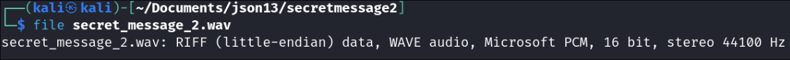
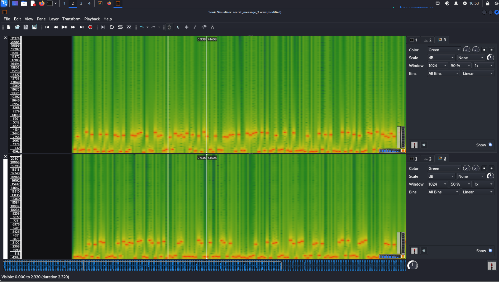

# Hidden message - part 2
**Challenge author:** Jimmy Johansson (bearbetning@outlook.com)
**Category:** Cryptography

## Challenge Description
A WAV file has been intercepted, which we suspect contains critical information. Your mission is to extract the key and decode the message.
This message could change the course of events. Use any means necessary to unveil its secrets!

Good luck, agent.

Author: Jimmy Johansson (bearbetning@outlook.com) 

[secret_message_2.wav](https://ctf.appsec.nu/files/554ad1dd82950f837471c5916619808b/secret_message_2.wav?token=eyJ1c2VyX2lkIjoyMDQsInRlYW1faWQiOjg1LCJmaWxlX2lkIjoyM30.Z2WMEQ.eRz-6CzcnLfoq6t9hJaygYOHhjg)

> Note. 
> The wav files is also available in the hidden_message_2/ directory if the url stops working.

# Solution 
First, I used the `file` utility to detemine the type of the downloaded file. This reveals it being a WAVE audio file, which was no suprise. What is worth noting is that the audio file is a stereo file, meaning it has two audio channels, one for left and one for right. 

After confirminig the file being a audio file, it was opened in [sonicvisualiser](https://www.sonicvisualiser.org), which  is a tool that allows us to view the audio through different spectrograms and is in general great for analyzing audio files. Putting each channel of the audio file into a spectrogram, reveals some high and low frequencies tones being played in each channel.

> The top sectrogam is channel 1 and the bottom is channel 2.

Each high tone and low tone are not exactly the same frequency each time, however they are close enough to classify as either high, which will become a 1 and and low, which will become a 0.

After manually going though the audio, once for each channel, and writing each high tone as a 1 and low tone as a 0, we get the two binary strings:

Channel 1:
`010010100101001101001111010011100101111101010110010011110100111101010010010010000100010101000101010100110101111101001000010000010101001101011111010110010100111101010101`

Channel 2:
`00000101011000010111101100110101000011000001100100011010000000010001011000011011000110100000110100011100000011010001101000001000000100010001001100011100011011100010100`

Decoding the binary using [CyberChef](https://cyberchef.org/#recipe=From_Binary('Space',8)), channel 1 gives the readable string: `JSON_VOORHEES_HAS_YOU` and channel 2 the string `a{5

n`, which is not readable. 

To get the flag, the two binay values need to be XORed with each other, which is possible with CyberChef. Once the two binary strings have been XORed, the flag is revealed: `O24{SOUNDS_HORRIBLE!}`

> Note
> When using cyberchef to XOR the two binary values, the 'From Binary' operation needs to be used  before the 'XOR' operation. Also, remember to select binary has the type of the key.

Merry XMAS!